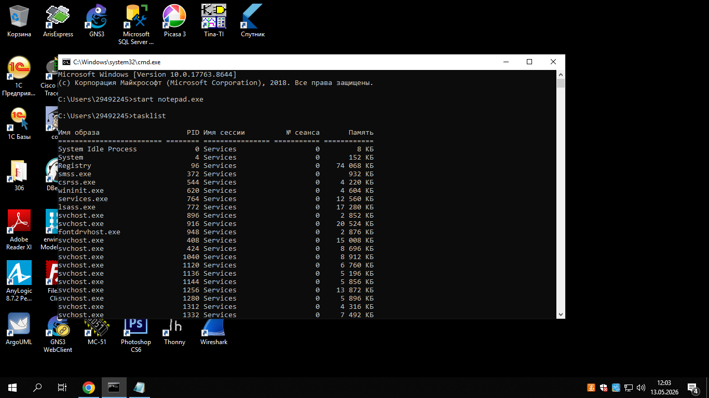
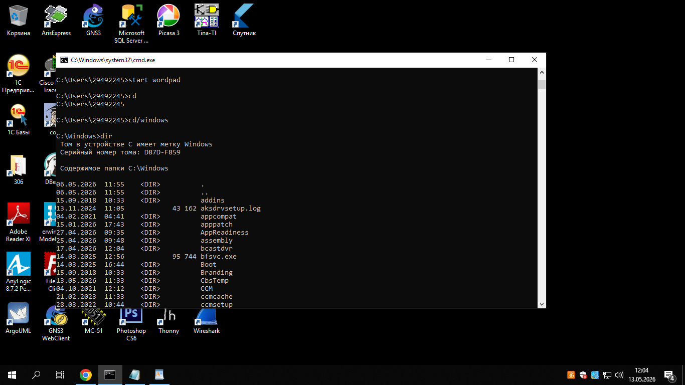

Лабораторная работа № 2 Управление памятью и процессами в ОС Windows Цель работы: Практическое знакомство с управлением вводом/выводом в операционных системах Windows и кэширования операций ввода/вывода.

ЗАДАНИЕ 2. Командная строка Windows.

Для запуска командной строки в режиме Windows следует нажать: (Пуск) > «Все программы» > «Стандартные» > «Командная строка»
Поработайте выполнением основных команд работы с процессами: запуская, отслеживая и завершая процессы. Основные команды[1][2]: Schtasks — выводит выполнение команд по расписанию; Start — запускает определенную программу или команду в отдельном окне; Taskkill — завершает процесс; Tasklist — выводит информацию о работающих процессах.
В появившемся окне наберите: cd\ — переход в корневой каталог; cd windows – переход в каталог Windows; dir — просмотр содержимого каталога. В данном каталоге мы можем работать с такими программами как «WordPad» и «Блокнот».
Запустим программу «Блокнот»: C:\Windows > start notepad.exe Отследим выполнение процесса: C:\Windows > tasklist Затем завершите выполнение процесса: C:\Windows > taskkill /IM notepad.exe
Самостоятельно, интуитивно, найдите команду запуска программы WordPad. Необходимый файл запуска найдите в папке Windows.
Выполнение задания включить в отчет по выполнению лабораторной работы.

ЗАДАНИЕ 3.

Отследите выполнение процесса notepad.exe при помощи диспетчера задач и командной строки.
Продемонстрируйте преподавателю завершение и повторный запуск процесса explorer.exe из: Диспетчера задач; Командной строки.
Выполнение задания включить в отчет по выполнению лабораторной работы
.png>)
ЧЕРЕЗ ДИСПЕТЧР:

ЧЕРЕЗ CMD:
